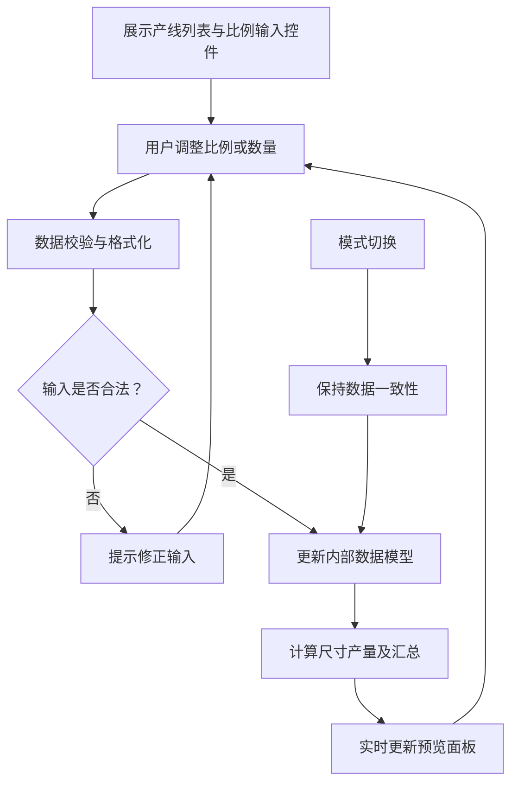

# 软件开发需求说明书

## 1. 总体描述

本需求旨在开发一套用户友好的界面，用于面板产线（Gen）的尺寸产量规划。用户可以为不同面板产线在未来 2025～2028 年内设置各尺寸的生产比例，系统会根据基础产量数据与用户输入的比例自动计算各尺寸在各年份的生产输出，并按尺寸进行汇总展示。同时，系统提供**实时结果预览**和**同步更新**功能，确保用户在调整比例时能够即时查看计算结果。当前阶段暂不实现数据持久化，后续可扩展至保存与版本控制。

---

## 2. 数据源

### 2.1 面板产线产量基础数据

各面板产线在未来几年的产量基础数据示例如下：

| Gen Group  | 2025 | 2026 | 2027 | 2028 |
| ---------- | ---- | ---- | ---- | ---- |
| Large Gen  | 30   | 20   | 10   | 0    |
| Mid Gen    | 10   | 10   | 10   | 10   |
| Small Gen  | 10   | 20   | 30   | 40   |

*说明：上表中各数值表示各面板产线的年产量基数。*

### 2.2 尺寸映射关系

各面板产线对应可生产的尺寸如下：

- **Large Gen:** 116", 152"
- **Mid Gen:** 81", 116"
- **Small Gen:** 81", 60"

*说明：映射关系用于确定各产线产量如何在不同尺寸间分配。*

*注意：数据源和尺寸映射关系不是固定不变的，未来将支持从外部数据源读取，目前POC阶段采用独立的mock数据。*

---

## 3. 功能需求

### 3.1 用户输入

用户可通过两种模式进行输入：比例模式和数量模式。

#### 3.1.1 比例模式（Ratio Mode）

- **输入方式：**
  - **数字输入框**：支持用户直接输入具体百分比，便于精准设置。
  - **数据验证**：输入的比例可以为正负整数或小数；同一 Gen Group 在同一年的各尺寸比例之和必须严格等于 100%。
  - **操作方式**：支持键盘输入、上下箭头调整、鼠标滚轮调整。

- **示例（以 Mid Gen 为例）：**

  | 年份  | 81"  | 116" |
  | ----- | ---- | ---- |
  | 2025  | 20%  | 80%  |
  | 2026  | 40%  | 60%  |
  | 2027  | 50%  | 50%  |
  | 2028  | 60%  | 40%  |

#### 3.1.2 数量模式（Quantity Mode）

- **输入方式：**
  - **数字输入框**：支持用户直接输入具体数量，系统自动计算对应比例。
  - **数据验证**：输入的数量可以为正负数或小数，精确到小数点后一位。
  - **操作方式**：支持键盘输入、上下箭头调整、鼠标滚轮调整。

- **示例（以 Mid Gen 为例）：**

  | 年份  | 81"  | 116" |
  | ----- | ---- | ---- |
  | 2025  | 2.0  | 8.0  |
  | 2026  | 4.0  | 6.0  |
  | 2027  | 5.0  | 5.0  |
  | 2028  | 6.0  | 4.0  |

#### 3.1.3 比例总表设计

系统内部需要维护一张【比例总表】，用于整合和保存所有产生的数据。未来，此表将存入数据库；在POC阶段，可通过日志方式打印输出验证数据。数据表示例如下：

| id  | gen_group  | year | size  | percentage | 
| --- | ---------- | ---- | ----- | ---------- |
| 1   | Mid Gen    | 2025 | 81"   | 20         |
| 2   | Mid Gen    | 2025 | 116"  | 80         |
| 3   | Large Gen  | 2025 | 116"  | 40         |
| 4   | Large Gen  | 2025 | 152"  | 60         |

*说明：每行记录表示某一产线（Gen Group）在特定年份下对某一尺寸的比例设置。*

---

### 3.2 数值计算

- **计算方法：**  
  对于每个 Gen Group，在某一年内各尺寸的产量按以下公式计算：  
  尺寸产量 = 基础产量 × (比例 / 100)

- **示例（2025年 Mid Gen）：**  
  - 基础产量：10  
  - 比例设置：81"为20%，116"为80%  
  - 计算结果：  
    - 81"产量 = 10 × (20 / 100) = 2.0  
    - 116"产量 = 10 × (80 / 100) = 8.0

- **负值处理：**
  - 系统支持负值输入和计算，负值在界面中以玫瑰红色（rose-500）显示。
  - 零值在界面中以浅灰色（gray-300）显示，减少视觉干扰。

---

### 3.3 结果汇总显示

- **合并规则：**  
  对于同一尺寸，如果多个 Gen Group 均有计算结果，则直接将各结果相加，得到全局汇总产量。

- **汇总结果展示示例：**

  | 尺寸   | 2025 | 2026 | 2027 | 2028 |
  | ------ | ---- | ---- | ---- | ---- |
  | 152"   | 12.0 | 18.0 | 10.0 | 5.0  |
  | 116"   | 30.0 | 10.0 | 5.0  | 5.0  |
  | 81"    | 20.0 | 15.0 | 10.0 | 5.0  |

  *说明：各尺寸的累计值为所有相关 Gen Group 计算结果的总和。所有数值保留一位小数。*

---

### 3.4 实时结果预览

- **即时反馈：**  
  系统在用户调整数字输入框的同时，自动根据最新比例重新计算各尺寸的产量，并在预览面板中实时更新显示结果。

- **预览展示要求：**  
  - 页面中应设置固定或浮动的预览区域，显示各 Gen Group 的详细计算结果及全局汇总数据。
  - 预览区域应展示单个 Gen Group 内各尺寸的分布情况，便于用户直观了解调整对产量分布的影响。
  - 表格列宽固定，避免在切换模式时出现抖动。

---

### 3.5 用户辅助功能

- **信息提示（Tooltips）：**
  - 系统为各主要功能区域提供详细的信息提示，帮助用户理解功能和操作方式。
  - 提示内容包括标题和格式化的详细说明，使用列表和颜色标记增强可读性。

- **输入优化：**
  - 支持直接输入负数和小数
  - 支持使用键盘上下箭头调整数值
  - 支持使用鼠标滚轮调整数值
  - 数值显示始终保持一位小数，确保格式一致性

---

### 3.6 数据持久化

- **当前阶段：**  
  数据持久化暂不实现。所有用户输入和计算结果仅在当前会话有效，页面刷新后恢复初始状态。未来可根据需求扩展保存功能。

---

## 4. 用户界面设计

### 4.1 输入交互与同步更新

- **实时校验：**
  - 在用户修改输入时，系统保证同一数据区域内的比例总和始终为100%。
  - 当用户在数量模式下调整一个尺寸的数量时，系统自动调整另一尺寸的数量，确保总量与基础产量一致。

- **模式切换：**
  - 用户可以在比例模式（Ratio）和数量模式（Quantity）之间自由切换。
  - 切换模式时保持数据一致性，不会丢失已设置的值。

### 4.2 视觉反馈

- **数值颜色编码：**
  - 正常值：深灰色（gray-600）
  - 负值：玫瑰红色（rose-500）
  - 零值：浅灰色（gray-300）

- **表格布局：**
  - 固定列宽设计，确保在不同模式间切换时不会出现布局抖动。
  - Gen Group 列：120px
  - Isopipe 列：100px
  - 年份列：每列 120px

### 4.3 预览面板

- 页面中设有专门的预览区域，用于实时显示最新的产量计算结果与汇总数据，帮助用户直观理解调整比例的影响。
- 预览区域使用与输入区域相同的颜色编码，保持视觉一致性。

---

## 5. 技术实现

### 5.1 组件结构

- **InputCell：** 通用输入单元，支持多种输入方式和格式化。
- **QuantityControl：** 数量模式的控制组件，处理数量输入和比例计算。
- **RatioControl：** 比例模式的控制组件，处理比例输入和验证。
- **ControlTable：** 表格控制组件，负责渲染输入区域和处理行列布局。
- **ResultTable：** 结果表格组件，负责渲染汇总结果。
- **TabControl：** 模式切换控件，管理比例和数量模式的切换。

### 5.2 数据流

- 用户输入 → 数据验证 → 更新内部状态 → 计算结果 → 更新UI
- 模式切换时，保持内部数据模型不变，仅改变展示和输入方式

---

测试数据源：

```javascript
export const productionBase = {
  "Large Gen": { "2025": 30, "2026": 20, "2027": 10, "2028": 0 },
  "Mid Gen": { "2025": 10, "2026": 10, "2027": 10, "2028": 10 },
  "Small Gen": { "2025": 10, "2026": 20, "2027": 30, "2028": 40 }
};

export const sizeMapping = {
  "Large Gen": ['116"', '152"'],
  "Mid Gen": ['81"', '116"'],
  "Small Gen": ['81"', '60"']
};


// 示例初始数据：可能只有 Mid Gen 和 Large Gen 两个产线
export const initialProductionPlans: ProductionPlan[] = [
  {
    genGroup: "Mid Gen",
    plans: [
      { year: "2025", ratios: { '81"': 20, '116"': 80 } },
      { year: "2026", ratios: { '81"': 40, '116"': 60 } },
      { year: "2027", ratios: { '81"': 50, '116"': 50 } },
      { year: "2028", ratios: { '81"': 60, '116"': 40 } }
    ]
  },
  {
    genGroup: "Large Gen",
    plans: [
      { year: "2025", ratios: { '116"': 40, '152"': 60 } },
      { year: "2026", ratios: { '116"': 50, '152"': 50 } },
      { year: "2027", ratios: { '116"': 60, '152"': 40 } },
      { year: "2028", ratios: { '116"': 70, '152"': 30 } }
    ]
  }
];
```

